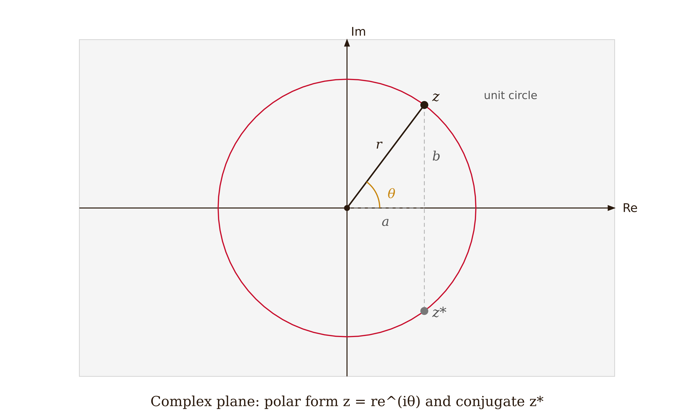
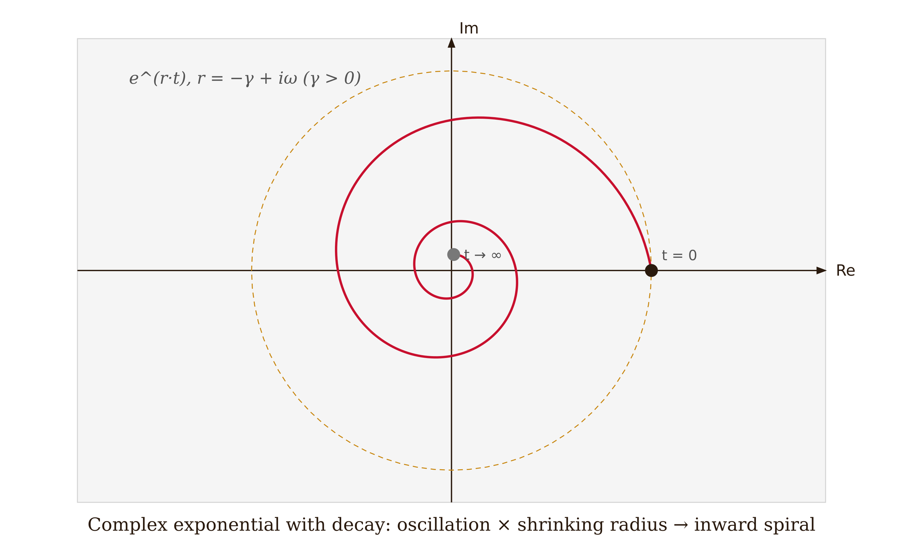
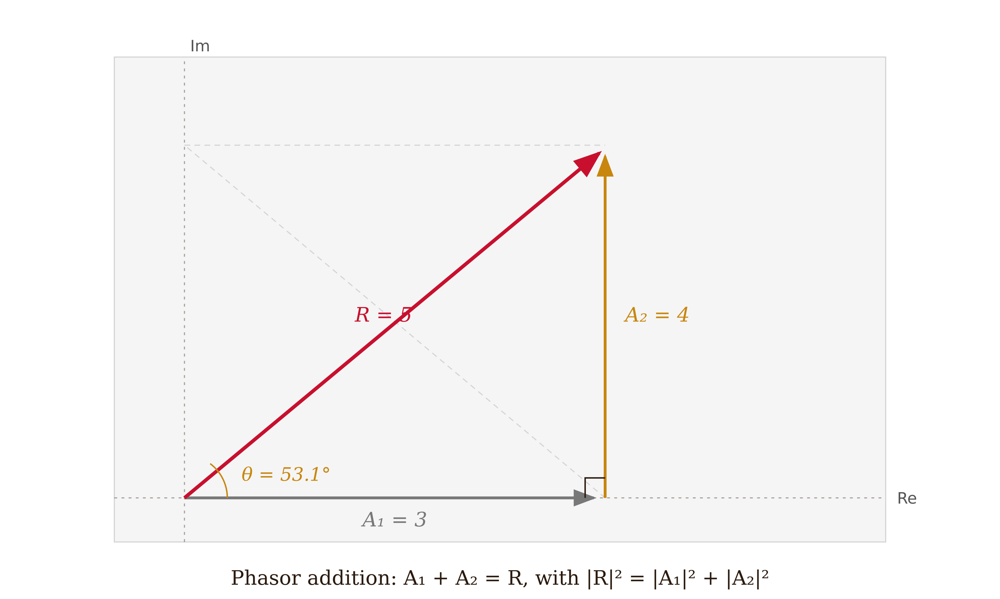
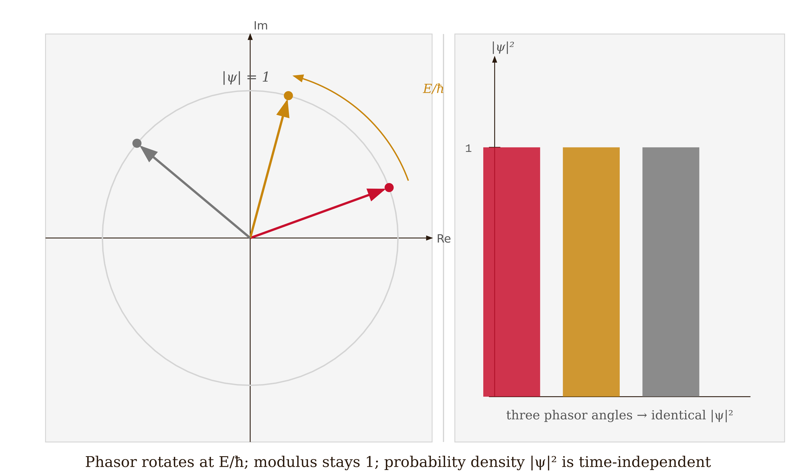

# Module M-01 — Complex Numbers and the Complex Exponential

**When you need this:** QM Vol. I Chs. 3 and 8 use complex arithmetic on every page; Ch. II·7 (spin) requires complex two-component vectors and phase factors under rotation.

---

## Complex Arithmetic

A complex number is a pair of real numbers written as $z = a + bi$, where $i^2 = -1$. The real part is $\text{Re}(z) = a$ and the imaginary part is $\text{Im}(z) = b$. The **complex conjugate** reverses the sign of the imaginary part: $z^* = a - bi$. The **modulus** is

$$|z| = \sqrt{z z^*} = \sqrt{a^2 + b^2} \geq 0.$$

Addition is performed componentwise. Multiplication follows ordinary algebra with $i^2 = -1$ substituted wherever it appears:

$$(a + bi)(c + di) = (ac - bd) + (ad + bc)i.$$

For division, we multiply both numerator and denominator by the conjugate of the denominator:

$$\frac{1}{c + di} = \frac{c - di}{c^2 + d^2}.$$

This converts a complex denominator into a real one. That substitution is the only genuinely new arithmetic move; everything else is ordinary algebra with one rule.

---

## Polar Form and Euler's Formula

We can plot $z$ as a point $(a, b)$ in the complex plane. The number is equally described by its distance from the origin $r = |z|$ and its angle $\theta = \text{atan2}(b, a)$ from the positive real axis. In polar form, multiplication is straightforward: lengths multiply and angles add. We can see this directly once Euler's formula is established.

*Figure 1.1 — The complex plane: point z in the first quadrant with radial line r, angle arc θ, right-triangle projections a and b, and conjugate z* reflected across the real axis.*

Substituting $x = i\theta$ into the Maclaurin series $e^x = \sum_{n=0}^\infty x^n/n!$ and sorting even and odd powers using the cycle $i^2 = -1$, $i^3 = -i$, $i^4 = 1$, $\ldots$ gives

$$e^{i\theta} = 1 + i\theta - \frac{\theta^2}{2!} - i\frac{\theta^3}{3!} + \frac{\theta^4}{4!} + \cdots = \underbrace{\left(1 - \frac{\theta^2}{2!} + \frac{\theta^4}{4!} - \cdots\right)}_{\cos\theta} + i\underbrace{\left(\theta - \frac{\theta^3}{3!} + \frac{\theta^5}{5!} - \cdots\right)}_{\sin\theta}.$$

Therefore:

$$\boxed{e^{i\theta} = \cos\theta + i\sin\theta.}$$

This is Euler's formula. Any complex number can be written as $z = re^{i\theta}$. The unit circle consists of all points $e^{i\theta}$ for real $\theta$; every such point has modulus 1.

Key results that follow directly: $\cos\theta = \text{Re}(e^{i\theta})$; $\sin\theta = \text{Im}(e^{i\theta})$; $|e^{i\theta}| = 1$ for all real $\theta$.

---

## Complex Exponentials Encode Oscillation and Decay Together

A complex exponent $r = -\gamma + i\omega$ gives

$$e^{rt} = e^{-\gamma t}(\cos\omega t + i\sin\omega t).$$

The real part of the exponent governs the decay envelope; the imaginary part gives the oscillation frequency. Both phenomena — damping and oscillation — are captured in a single complex exponential.

*Figure 1.3 — Decaying complex exponential e^(rt) with r = −γ + iω: a spiral starting on the positive real axis and winding counterclockwise inward as t increases, converging toward the origin.*

A **complex amplitude** $\tilde A = Ae^{i\phi}$ packages magnitude and phase into one number:

$$A\cos(\omega t + \phi) = \text{Re}(\tilde A\, e^{i\omega t}).$$

Adding two oscillations of the same frequency then reduces to adding two complex numbers — one vector addition in the plane — rather than applying trigonometric identities.

---

## Worked Example: Phasor Addition

Add $x_1 = 3\cos(\omega t)$ and $x_2 = 4\cos(\omega t + 90°)$.

Complex amplitudes: $\tilde A_1 = 3$, $\tilde A_2 = 4e^{i\pi/2} = 4i$.

Sum: $\tilde A = 3 + 4i$.

$$|\tilde A| = \sqrt{9 + 16} = 5, \qquad \phi = \arctan(4/3) \approx 53.1°.$$

Result: $x_1 + x_2 = 5\cos(\omega t + 53.1°)$. We obtain the amplitude and phase from one right-triangle calculation, without expanding angle-sum formulas.

*Figure 1.2 — Phasor addition: first phasor of magnitude 3 along the real axis, second of magnitude 4 placed tip-to-tail along the imaginary axis, and resultant of magnitude 5 from the origin.*

---

## In the Quantum Series

**Vol. I, Ch. 3 —** $\psi$ **is intrinsically complex.** The Schrödinger equation carries an explicit $i$:

$$i\hbar\frac{\partial\psi}{\partial t} = \hat H\psi.$$

A real function cannot satisfy an equation requiring its time derivative to equal an imaginary multiple of itself. There is no "take the real part at the end" step. Both $\text{Re}(\psi)$ and $\text{Im}(\psi)$ are physically active.

The time-dependent factor for a stationary state of energy $E$ is $e^{-iEt/\hbar}$ — a phasor rotating at rate $E/\hbar$. Because $|e^{-iEt/\hbar}| = 1$, the probability density $|\psi(x,t)|^2 = |\psi(x)|^2$ is time-independent even though $\psi$ itself is rotating. This is why stationary states have definite energy but still evolve in the complex plane.

*Figure 1.4 — Stationary-state phasor: (left) three phasor snapshots at different angles, all on the unit circle; (right) three equal-height bars showing |ψ|² = constant regardless of the rotation angle.*

Born's rule gives $|\psi|^2 = \psi^*\psi$. For a superposition $\psi = \psi_1 + \psi_2$:

$$|\psi_1 + \psi_2|^2 = |\psi_1|^2 + |\psi_2|^2 + 2\text{Re}(\psi_1^*\psi_2).$$

The cross-term $2\text{Re}(\psi_1^*\psi_2)$ is the **interference term** — real and nonzero because $\psi$ is complex. The double-slit fringe pattern is this term made visible; it vanishes only when the relative phase is $\pm 90°$.

**Vol. I, Ch. 8 — Wave packets: superposing complex exponentials.** A free-particle wave packet is

$$\psi(x,t) = \int_{-\infty}^\infty\phi(k)\,e^{i(kx-\omega(k)t)}\,dk.$$

Every term is a complex exponential in both $x$ and $t$. The **envelope** travels at the group velocity $v_g = d\omega/dk$, which emerges from constructive interference of neighboring $k$-values — a Fourier argument stated entirely in complex-exponential language.

To find the group velocity, we expand $\omega(k)$ around the central wave number $k_0$: $\omega(k) \approx \omega_0 + v_g(k - k_0)$. Substituting and factoring $e^{i(k_0 x - \omega_0 t)}$, the remaining integral is a shape function that translates rigidly at speed $v_g$. The entire argument is a manipulation of complex exponential integrals; there is no real-valued version.

**Vol. II, Ch. 7 — Spin: phase factors and spinors.** A spin-½ state is a two-component complex vector. A rotation by angle $\phi$ about the $z$-axis acts with the operator

$$R_z(\phi) = \begin{pmatrix}e^{-i\phi/2} & 0 \\ 0 & e^{i\phi/2}\end{pmatrix}.$$

Because the phases are $e^{\pm i\phi/2}$, a full $2\pi$ rotation gives $e^{\pm i\pi} = -1$ — the spinor changes sign. It takes $720°$ to return a spin-½ spinor to its original value. This follows directly from the argument of $e^{i\phi/2}$ shifting by $\pi$ when $\phi \to \phi + 2\pi$.

---

## Conventions and Pitfalls

**Physics vs. engineering time convention.** Physicists write $e^{-i\omega t}$ for a positive-frequency mode. Engineers often write $e^{+j\omega t}$. The QM series uses $e^{-i\omega t}$ throughout. A formula copied from an engineering source may have its phase conjugated — verify the sign before importing it.

$\psi$ **is not the real part of anything.** In classical oscillation problems the standard procedure is: complexify, compute, take $\text{Re}(\cdot)$ at the end. In QM that final step does not exist. $\psi$ is genuinely complex; discarding $\text{Im}(\psi)$ loses physical information (interference, Berry phases, the Aharonov-Bohm effect).

**Modulus squared, not modulus.** The probability density is $|\psi|^2$, not $|\psi|$. Normalization is $\int|\psi|^2\,dx = 1$.

**Overall phase vs. relative phase.** The global phase of a state $e^{i\alpha}|\psi\rangle$ is unobservable: $|e^{i\alpha}\psi|^2 = |\psi|^2$. But the relative phase between two components of a superposition is observable and produces interference. Concluding "phase doesn't matter" from the former is exactly wrong for the latter.

**Argument is defined modulo** $2\pi$. The argument of $e^{i\phi}$ is not unique. For spinors the $2\pi$ ambiguity is physically meaningful: $e^{i(\phi+2\pi)/2} = -e^{i\phi/2}$.

---

## Quick Practice

1. Compute $(2+3i)(1-i)$ and $\dfrac{1+i}{2-i}$, expressing each in $a+bi$. Find the modulus and argument of $1+i$.

2. Using the cycle $i^0=1, i^1=i, i^2=-1, i^3=-i, \ldots$, derive $e^{i\pi/2}$ and $e^{i\pi}$ from the series $e^{i\theta} = \sum_{n=0}^\infty(i\theta)^n/n!$, and verify each result geometrically on the unit circle.

3. A superposition has $\psi(x,t) = \psi_1(x)e^{-iE_1 t/\hbar} + \psi_2(x)e^{-iE_2 t/\hbar}$. Show that $|\psi|^2$ oscillates in time at frequency $(E_2-E_1)/h$. Why does $|\psi|^2$ for a single eigenstate not oscillate?

---

## Go Deeper

For more on the series machinery behind Euler's formula, see Module M-04. For three worked examples (Bombelli's cubic, phasor addition, underdamped oscillator), see *Mathematics for Physics*, Vol. 1, Ch. 12.

For the QM applications of complex exponentials to operators: Shankar, *Principles of Quantum Mechanics*, Chs. 1 and 4 (time evolution operator $e^{-i\hat H t/\hbar}$); Cohen-Tannoudji, *Quantum Mechanics*, Vol. 1, Complement $B_\text{I}$.

---

## References

- Euler, L. *Introductio in analysin infinitorum* (1748), Book I, Chs. 7–8 (Euler Archive E101). [verify]
- Shankar, R. *Principles of Quantum Mechanics*, 2nd ed. Plenum, 1994. Chs. 1 and 4.
- Cohen-Tannoudji, C., Diu, B. and Laloë, F. *Quantum Mechanics*, Vol. 1. Wiley, 1977. Ch. I and Complement $B_\text{I}$.
- *Mathematics for Physics*, Vol. 1, Ch. 12 (source chapter for this module).
