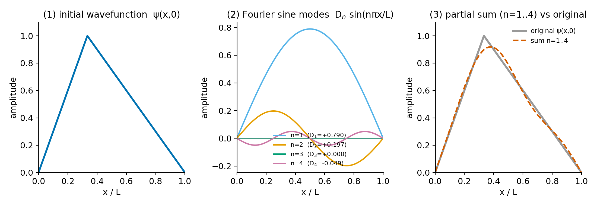
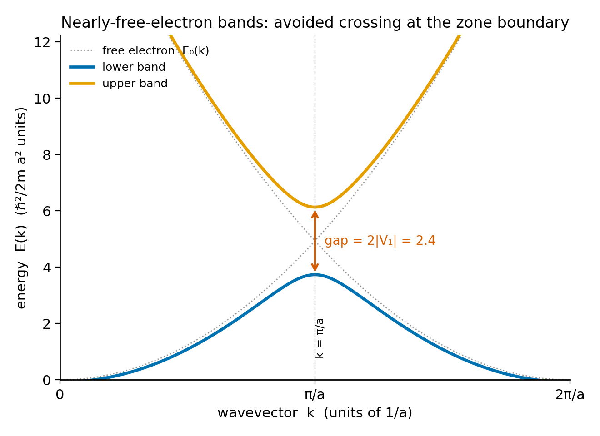

# Module M-05 — Fourier Series and the Wave Equation
*Why an arbitrary initial wavefunction can be written as a sum of eigenstates, and why that sum carries all the physics.*

The infinite square well asks you to write an arbitrary initial wavefunction as a superposition of energy eigenstates and time-evolve it. That calculation, stripped of its quantum notation, is a Fourier sine series on an interval. The Bloch theorem for electrons in a crystal rests on the fact that a periodic potential can be expanded in spatial harmonics, and each harmonic couples a definite pair of momentum states. Both are Fourier analysis, wearing different clothes. This module builds the machinery so those chapters are derivations rather than assertions.

---

## Partial Derivatives

A function $y(x, t)$ of two variables has two distinct rates of change. The **partial derivative** $\partial y/\partial x$ holds $t$ fixed and differentiates in $x$; $\partial y/\partial t$ holds $x$ fixed and differentiates in $t$. For a sinusoidal wave $y = A\sin(kx - \omega t)$:

$$\frac{\partial y}{\partial x} = Ak\cos(kx - \omega t) \quad\text{(slope of the spatial snapshot)},$$

$$\frac{\partial y}{\partial t} = -A\omega\cos(kx - \omega t) \quad\text{(transverse velocity of one point)}.$$

These are physically different — a slope (dimensionless) and a velocity (m/s) — measured from the same function at the same instant. The curly $\partial$ is the notation that prevents them from being confused.

---

## The Wave Equation and Linearity

Newton's second law applied to a small element of string under tension $F_T$ with mass per unit length $\mu$ gives the **one-dimensional wave equation**:

$$\frac{\partial^2 y}{\partial t^2} = v^2\frac{\partial^2 y}{\partial x^2}, \qquad v = \sqrt{\frac{F_T}{\mu}}.$$

Read it physically: curvature in space drives acceleration in time. Where the string is most bent, the tension mismatch is largest, and the string accelerates back hardest. The wave speed $v$ is a property of the medium alone.

The crucial property is **linearity**: every term in the equation is first-degree in $y$ and its derivatives. If $y_1$ and $y_2$ both satisfy the equation, so does $c_1 y_1 + c_2 y_2$ for any constants $c_1$, $c_2$. **Superposition is a direct consequence of linearity.** This is not a separate principle — it is what linearity means. The Schrödinger equation has exactly this property: $i\hbar\partial_t\psi = \hat{H}\psi$ is linear in $\psi$, so any superposition of solutions is a solution, and the energy-eigenstate expansion is the Fourier series of the wavefunction.

---

## Separation of Variables: Two ODEs from One PDE

Look for solutions of the form $y(x, t) = X(x)\,T(t)$. Substituting into the wave equation and dividing by $X(x)T(t)$:

$$\frac{T''(t)}{v^2 T(t)} = \frac{X''(x)}{X(x)}.$$

The left side depends only on $t$; the right side depends only on $x$. For this to hold for all $x$ and $t$, both sides must equal the same constant. Call it $-k^2$ (choosing the negative sign anticipates the oscillatory solutions we want). This splits into two ordinary differential equations:

$$X'' = -k^2 X \implies X(x) = A\sin(kx) + B\cos(kx),$$

$$T'' = -(vk)^2 T = -\omega^2 T \implies T(t) = C\sin(\omega t) + D\cos(\omega t),$$

with $\omega = vk$. Imposing boundary conditions — a string fixed at $x = 0$ and $x = L$ requires $y(0,t) = y(L,t) = 0$ — forces $B = 0$ and $\sin(kL) = 0$, giving the **quantized** wavenumbers:

$$k_n = \frac{n\pi}{L}, \qquad n = 1, 2, 3, \ldots$$

The allowed frequencies are $\omega_n = vk_n = n\pi v/L$. The general standing-wave mode is:

$$y_n(x,t) = \sin\!\left(\frac{n\pi x}{L}\right)\!\left[C_n\sin(\omega_n t) + D_n\cos(\omega_n t)\right].$$

This pattern repeats verbatim in quantum mechanics. The energy eigenstates of the infinite square well are found by separating the Schrödinger equation into time and space parts, imposing $\psi(0) = \psi(L) = 0$, and recovering the discrete set $k_n = n\pi/L$. The eigenstates are $\psi_n(x) = \sqrt{2/L}\sin(n\pi x/L)$. The mathematics is not analogous to the string — it is the same mathematics.

---

## Fourier Series: The General Solution

By superposition — linearity gives it free — the **general solution** is a sum over all modes:

$$y(x, t) = \sum_{n=1}^\infty \sin\!\left(\frac{n\pi x}{L}\right)\!\left[C_n\sin(\omega_n t) + D_n\cos(\omega_n t)\right].$$

At $t = 0$ this reduces to $y(x,0) = \sum_{n=1}^\infty D_n\sin(n\pi x/L)$ — any initial shape expressed as a sum of sines. This is the **Fourier sine series**. The coefficients $D_n$ are extracted by projecting onto each mode, using the **orthogonality** of the sine functions:

$$\int_0^L \sin\!\left(\frac{n\pi x}{L}\right)\sin\!\left(\frac{m\pi x}{L}\right)dx = \frac{L}{2}\,\delta_{nm}.$$

Multiply both sides of $y(x,0) = \sum_m D_m\sin(m\pi x/L)$ by $\sin(n\pi x/L)$ and integrate from 0 to $L$. The orthogonality kills every term except $m = n$:

$$\int_0^L y(x,0)\sin\!\left(\frac{n\pi x}{L}\right)dx = D_n\cdot\frac{L}{2} \implies D_n = \frac{2}{L}\int_0^L y(x,0)\sin\!\left(\frac{n\pi x}{L}\right)dx.$$

The structure is: expand in an orthogonal basis, project onto each basis function to find the coefficient. This is also how the Born rule works in quantum mechanics. The probability of measuring energy $E_n$ is $|c_n|^2$, where $c_n = \langle\psi_n|\psi\rangle = \int\psi_n^*(x)\psi(x)\,dx$ — a projection onto the eigenstate, exactly as above. The normalization condition $\sum_n|c_n|^2 = 1$ is Parseval's theorem applied to the wavefunction.

---

## The General Fourier Series

For a function of period $T$ with fundamental angular frequency $\omega_0 = 2\pi/T$, the **real Fourier series** is:

$$f(t) = \frac{a_0}{2} + \sum_{n=1}^\infty\!\left[a_n\cos(n\omega_0 t) + b_n\sin(n\omega_0 t)\right],$$

with $a_n = \frac{2}{T}\int_0^T f(t)\cos(n\omega_0 t)\,dt$ and $b_n = \frac{2}{T}\int_0^T f(t)\sin(n\omega_0 t)\,dt$. Fourier showed in 1822 that any periodic function — including one with corners or jump discontinuities — can be represented this way. [verify: Fourier, Théorie analytique de la chaleur (1822)] At jump discontinuities, the partial sums overshoot by about 9% of the jump height; this overshoot persists as more terms are added, though it narrows. This **Gibbs phenomenon** appears in periodic-potential problems where $V(x)$ has sharp steps.

## The Complex Form

Using Euler's formula $e^{in\omega_0 t} = \cos(n\omega_0 t) + i\sin(n\omega_0 t)$, the Fourier series takes the **complex form**:

$$f(t) = \sum_{n=-\infty}^\infty c_n\,e^{in\omega_0 t}, \qquad c_n = \frac{1}{T}\int_0^T f(t)\,e^{-in\omega_0 t}\,dt.$$

The sum runs over all integers — positive, zero, and negative — corresponding to positive and negative frequencies. For real-valued $f$, the coefficients satisfy $c_{-n} = c_n^*$, so no information is lost by going complex; the real and imaginary parts of each $c_n$ carry the cosine and sine amplitudes.

This complex form is what quantum mechanics actually uses. The spatial Bloch factor $e^{ikx}$ is a complex Fourier mode. The time-evolution factor $e^{-iE_n t/\hbar}$ is a complex phase. Writing quantum expansions in the real sin/cos form is possible but awkward; the complex form is the right language — and as the period $T\to\infty$, the discrete sum over $n$ becomes an integral over continuous frequency, connecting to the Fourier transform (M-06).

<!-- → [FIGURE: three-panel diagram showing (1) an arbitrary initial wavefunction in an infinite square well; (2) its decomposition into Fourier sine modes n=1,2,3,4, each shown as a separate standing wave with its amplitude; (3) the reconstituted sum of the first four modes overlaid on the original function; the visual goal is to make the Fourier-series-as-eigenstate-decomposition connection concrete before any quantum notation appears] -->

*Figure 5.1 — three-panel diagram showing (1) an arbitrary initial wavefunction in an infinite square well*

---

## Worked Example: A Parabolic Initial State in the Square Well

A particle in an infinite square well ($0 \leq x \leq L$) is prepared in the state $\psi(x,0) = Nx(L-x)$ — a parabola that vanishes at both walls. The energy eigenstates are $\psi_n = \sqrt{2/L}\sin(n\pi x/L)$ with energies $E_n = n^2\pi^2\hbar^2/2mL^2$.

The expansion coefficient for each eigenstate is:

$$c_n = \langle\psi_n|\psi(x,0)\rangle = N\sqrt{\frac{2}{L}}\int_0^L x(L-x)\sin\!\left(\frac{n\pi x}{L}\right)dx.$$

Before computing: $x(L-x)$ is symmetric about $x = L/2$, and so is $\sin(n\pi x/L)$ for odd $n$ (these modes peak at the center) but antisymmetric for even $n$ (these modes have a node at the center). An even-mode integrand is the product of a symmetric function and an antisymmetric function — odd overall — and integrates to zero over $[0,L]$. Therefore $c_n = 0$ for all even $n$ without computing any integral.

For odd $n$, the integral is nonzero and decreases as $1/n^3$ for large $n$. The state is dominated by the ground state ($n = 1$), with small contributions from $n = 3, 5, 7, \ldots$

Time evolution: multiply each coefficient by its independent phase:

$$\psi(x,t) = \sum_{n\,\text{odd}} c_n\,e^{-iE_n t/\hbar}\,\psi_n(x).$$

The probability density $|\psi(x,t)|^2$ oscillates because different modes advance their phases at rates $\omega_n = E_n/\hbar = n^2\pi^2\hbar/2mL^2$. The beating between modes — interference between terms at different frequencies — produces the oscillating probability density. At special revival times, many modes return to nearly the same relative phase they had at $t = 0$, and the original parabola approximately reforms. This **quantum revival** is a purely Fourier phenomenon: constructive interference between incommensurable frequencies.

The lesson: the quantum dynamics of this problem is the Fourier series of $\psi(x,0)$ in the eigenstate basis, with each term acquiring an independent time-dependent phase. No new quantum mechanics is required; the quantum content is in $E_n$ and the phases $e^{-iE_n t/\hbar}$.

---

## Periodic Potentials and Bloch's Theorem

A crystal has a periodic potential $V(x+a) = V(x)$ where $a$ is the lattice spacing. Because $V$ is periodic, it has a Fourier series:

$$V(x) = \sum_{n=-\infty}^\infty V_n\,e^{i(2\pi n/a)x}, \qquad V_n = \frac{1}{a}\int_0^a V(x)\,e^{-i(2\pi n/a)x}\,dx.$$

The wavevectors $G_n = 2\pi n/a$ are the **reciprocal lattice vectors**. Each Fourier component $V_n$ couples momentum states that differ by $\hbar G_n$: the matrix element $\langle k'|V|k\rangle = V_n\delta_{k',k+G_n}$ connects plane-wave states whose momenta differ by $n$ reciprocal lattice vectors.

Bloch's theorem — that eigenstates of a periodic Hamiltonian take the form $\psi_k(x) = e^{ikx}u_k(x)$ where $u_k$ has the lattice periodicity — follows directly from this structure. Since $u_k$ is periodic, it has its own Fourier expansion $u_k(x) = \sum_n A_n e^{iG_n x}$, making the Bloch state a superposition of plane waves at momenta $\hbar(k + G_n)$:

$$\psi_k(x) = \sum_n A_n\,e^{i(k+G_n)x}.$$

The energy bands and gaps at the Brillouin zone boundary ($k = \pm\pi/a$) arise where two plane waves — with momenta $\hbar k$ and $\hbar(k - G_1) = \hbar(k - 2\pi/a)$ — are degenerate in the free-particle case and get mixed by the Fourier component $V_1$ of the potential. The gap width is $2|V_1|$: the magnitude of the relevant Fourier coefficient of $V$, and nothing else. The entire band-gap theory is linear algebra applied to a $2\times2$ matrix whose off-diagonal element is a Fourier coefficient.

<!-- → [FIGURE: schematic of the nearly-free-electron band structure at the first Brillouin zone boundary — showing the parabolic free-electron dispersion, then the avoided crossing at k = ±π/a with gap width labeled 2|V₁|; below, show the real-space potential V(x) and its Fourier decomposition with V₁ highlighted; the visual goal is to connect the size of the gap directly to the Fourier coefficient of the potential] -->

*Figure 5.2 — schematic of the nearly-free-electron band structure at the first Brillouin zone boundary — showing the parabolic free-electron dispersion,…*

---

## Quick Practice

1. **Coefficient integral.** A square-well particle is in a state approximated as $\psi(x,0) \propto \cos(\pi x/L)$ (shifted to vanish at the walls by using $\psi \propto \cos(\pi x/L) - \cos(\pi \cdot 0/L)$ — actually, use $\psi(x,0) = A\sin^2(\pi x/L)$ for a simpler exercise). Compute $c_1$ and $c_2$, the projections onto the first two square-well eigenstates, using the orthogonality integral. Explain from symmetry why $c_2 = 0$ without computing the integral.

2. **Complex Fourier series.** Convert the real Fourier series $f(t) = \cos(\omega_0 t) + \tfrac{1}{2}\sin(2\omega_0 t)$ into the complex form $f(t) = \sum_n c_n e^{in\omega_0 t}$. Identify all nonzero $c_n$ and verify $c_{-n} = c_n^*$.

3. **Bloch gap.** A weak periodic potential has Fourier coefficients $V_0 = -1.0$ eV (the average), $V_1 = V_{-1} = -0.1$ eV, and all higher coefficients negligible. At the first Brillouin zone boundary $k = \pi/a$, two free-electron states are degenerate. The gap width is $2|V_1|$. Find the energy gap and identify which physical quantity — the lattice spacing, the electron mass, or the potential — determines which states are coupled.

---

## Exercises

**Warm-up**

1. *Difficulty: Warm-up — tests partial derivatives.*
   For $y(x,t) = 3\sin(2x - 5t) + \cos(x + t)$: (a) compute $\partial y/\partial x$; (b) compute $\partial y/\partial t$; (c) verify that each term satisfies the wave equation $\partial^2 y/\partial t^2 = v^2\,\partial^2 y/\partial x^2$ and identify the wave speed $v$ in each case.
   *Tests: partial differentiation; verifying the wave equation; identifying wave speed.*

2. *Difficulty: Warm-up — tests the orthogonality of sine functions.*
   Evaluate directly by integration: (a) $\int_0^L \sin(n\pi x/L)\sin(m\pi x/L)\,dx$ for $n = m = 2$; (b) for $n = 1$, $m = 2$. Then use these results to verify the orthogonality formula $\int_0^L \sin(n\pi x/L)\sin(m\pi x/L)\,dx = (L/2)\delta_{nm}$ for both cases.
   *Tests: direct evaluation of trigonometric integrals; confirming orthogonality numerically before accepting it abstractly.*

3. *Difficulty: Warm-up — tests the complex Fourier series.*
   The function $f(t) = e^{i\omega_0 t}$ is periodic with period $T = 2\pi/\omega_0$. (a) Write its complex Fourier series $f(t) = \sum_n c_n e^{in\omega_0 t}$ by inspection and identify all $c_n$. (b) Now for $f(t) = \cos(\omega_0 t)$: write $\cos(\omega_0 t)$ in terms of complex exponentials and read off all nonzero $c_n$. (c) Verify $c_{-1} = c_1^*$ for the cosine case.
   *Tests: reading complex Fourier coefficients directly from exponential form; the $c_{-n} = c_n^*$ property for real functions.*

**Application**

4. *Difficulty: Application — Fourier coefficient of the parabolic initial state.*
   For the parabola $\psi(x,0) = Nx(L-x)$ in an infinite square well: (a) use the normalization condition $\int_0^L|Nx(L-x)|^2\,dx = 1$ to find $N$ (evaluate the integral by expanding $(x(L-x))^2 = L^2x^2 - 2Lx^3 + x^4$ and integrating term by term); (b) without computing any integral, explain from symmetry why $c_2 = c_4 = c_6 = \cdots = 0$; (c) the integral $\int_0^L x(L-x)\sin(n\pi x/L)\,dx$ for odd $n$ evaluates to $4L^3/(n^3\pi^3)$. Use this to write $c_1$ explicitly in terms of $L$, $N$, and numerical constants.
   *Tests: normalization of a polynomial state; symmetry argument for vanishing even coefficients; explicit coefficient computation.*

5. *Difficulty: Application — quantum revival from a two-mode superposition.*
   A square-well particle is in the state $\psi(x,t) = \tfrac{1}{\sqrt{2}}(\psi_1 e^{-iE_1 t/\hbar} + \psi_3 e^{-iE_3 t/\hbar})$. (a) Compute $|\psi(x,t)|^2$ and identify the oscillation frequency of the cross term in terms of $E_1$ and $E_3 = 9E_1$. (b) Find the period $T_\text{rev}$ at which the cross-term phase returns to its $t=0$ value, restoring the original probability density. (c) Write the probability density at $t = T_\text{rev}/2$ and describe how it differs from $t = 0$.
   *Tests: computing probability density for a superposition; revival time from Fourier beating; physical interpretation of the oscillation.*

6. *Difficulty: Application — band gap from a Fourier coefficient.*
   A periodic potential in 1D with lattice spacing $a = 0.5$ nm has Fourier coefficients $V_0 = -10$ eV, $V_1 = V_{-1} = -0.5$ eV. (a) At the first Brillouin zone boundary, $k = \pi/a$; compute this wavevector in nm$^{-1}$ and the free-electron kinetic energy at this $k$ for an electron. (b) The two degenerate states at the zone boundary are $e^{ikx}$ and $e^{i(k-2\pi/a)x}$; verify they have the same kinetic energy. (c) The gap width is $2|V_1|$; find the gap in eV. (d) Which Fourier coefficient of $V(x)$ would need to be changed to affect the gap at the second Brillouin zone boundary ($k = 2\pi/a$)?
   *Tests: Brillouin zone boundary; degenerate free-electron states; gap from Fourier coefficient; identifying which coefficient controls which gap.*

**Synthesis**

7. *Difficulty: Synthesis — Parseval's theorem as normalization.*
   For a normalized state $\psi(x,0) = \sum_n c_n\psi_n(x)$ in an infinite square well, where $\langle\psi_m|\psi_n\rangle = \delta_{mn}$: (a) compute $\langle\psi(x,0)|\psi(x,0)\rangle = \int_0^L|\psi(x,0)|^2\,dx$ by expanding the product $\psi^*\psi$ in the eigenstate sum and using orthogonality. Show the result is $\sum_n|c_n|^2$. (b) Since $\psi$ is normalized, $\sum_n|c_n|^2 = 1$. Interpret $|c_n|^2$ as a probability. (c) Now compute $\langle\hat{H}\rangle = \langle\psi|\hat{H}|\psi\rangle$ using the same expansion. Show the result is $\sum_n E_n|c_n|^2$ and interpret it as an expectation value.
   *Tests: Parseval's theorem from first principles via orthogonality; Born rule as Fourier coefficient squared; expectation value as probability-weighted sum of eigenvalues.*

8. *Difficulty: Synthesis — Bloch's theorem from Fourier structure.*
   A Hamiltonian has a periodic potential $V(x) = V_0 + 2V_1\cos(2\pi x/a)$ (keeping only the first non-constant Fourier mode). (a) Write $V(x)$ in terms of complex exponentials. (b) The matrix element $\langle k'|V|k\rangle = \int e^{-ik'x}V(x)e^{ikx}\,dx/(2\pi)$ is nonzero only for specific pairs $(k, k')$; identify all pairs for this potential. (c) Construct the $2\times2$ matrix in the degenerate subspace spanned by $e^{ikx}$ and $e^{i(k-2\pi/a)x}$ at the first zone boundary. (d) Diagonalize it and find the two energy eigenvalues. Confirm the gap is $2|V_1|$.
   *Tests: full derivation of band gap from the Fourier structure of the potential; connecting abstract Bloch theorem to concrete matrix diagonalization.*

**Challenge**

9. *Difficulty: Challenge — Gibbs phenomenon and its physical irrelevance.*
   The square wave $V(x) = V_0$ for $0 < x < a/2$ and $V(x) = -V_0$ for $a/2 < x < a$ (period $a$) models a Kronig-Penney-type potential. (a) Compute the Fourier coefficients $V_n = \frac{1}{a}\int_0^a V(x)e^{-i(2\pi n/a)x}\,dx$ for all $n$. Show that $V_n = 0$ for even $n$ and $V_n = 2iV_0/(n\pi)$ for odd $n$ — a $1/n$ decay, slower than the $1/n^3$ of the smooth parabola. (b) The Gibbs phenomenon says that the partial sum $S_N(x) = \sum_{n=-N}^{N} V_n e^{i(2\pi n/a)x}$ overshoots $V(x)$ by about 9% near the jump as $N\to\infty$. Estimate the amplitude of the Gibbs overshoot for this potential. (c) Despite the Gibbs overshoot, the matrix element $\langle k'|V|k\rangle$ at the zone boundary uses the exact Fourier coefficient $V_1$, not the partial sum. Explain why the energy gap is unaffected by the Gibbs phenomenon — that is, why the physical prediction is exact even though the spatial representation of $V(x)$ converges slowly.
   *Tests: computing Fourier coefficients of a discontinuous function; understanding the Gibbs phenomenon quantitatively; distinguishing spatial convergence from the accuracy of specific Fourier coefficients.*

---

## References

d'Alembert, J. (1749). Recherches sur la courbe que forme une corde tendue mise en vibration. *Mémoires de l'Académie royale des sciences de Berlin*.

Bernoulli, D. (1753). Réflexions et éclaircissements sur les nouvelles vibrations des cordes. *Mémoires de l'Académie royale des sciences de Berlin*.

Fourier, J. (1822). *Théorie analytique de la chaleur*. Firmin Didot.

Bloch, F. (1929). Über die Quantenmechanik der Elektronen in Kristallgittern. *Zeitschrift für Physik*, 52, 555–600.

Kronig, R., & Penney, W. (1931). Quantum mechanics of electrons in crystal lattices. *Proceedings of the Royal Society of London A*, 130, 499–513.
