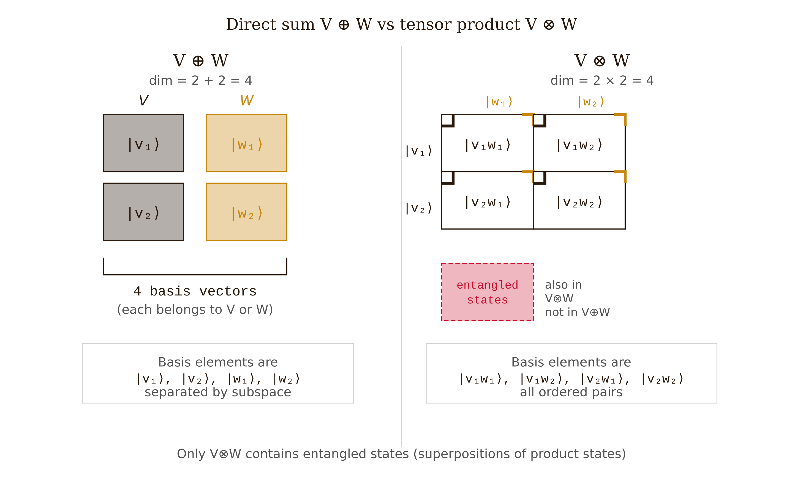
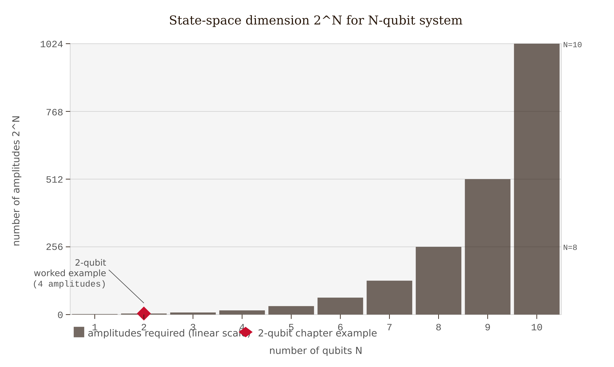
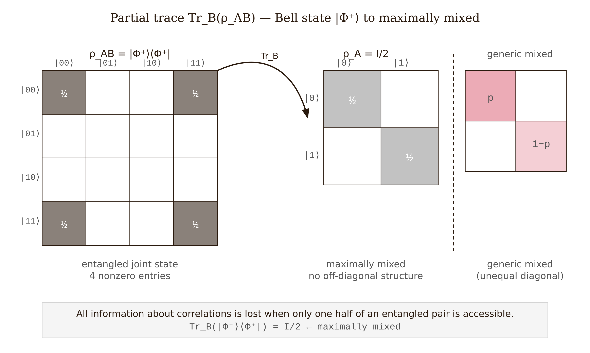

# Module M-16 — Tensor Products and Composite-System Linear Algebra

**Refresher for QM chapters:** IV·2, IV·4, IV·5

**Primary references:** Nielsen & Chuang §2.1, Preskill Ph229 Ch. 3, Peres Ch. 5

---

## When You Need This

Read this module before **IV·2** (entanglement), **IV·4** (quantum gates), or **IV·5** (teleportation). All three chapters open with multi-qubit states — vectors in a composite Hilbert space — and the tensor product is the only way to build that space. Without it, we can follow individual equations but not understand why the structure is the way it is.

Prerequisite: Module M-07 — basis, dimension, linear independence, inner product, and operators as matrices. The tensor product is a new construction *on* vector spaces; it extends that machinery rather than replacing it.

---

## The Central Fact: Dimension Multiplies

When two classical systems are combined, the number of joint states is the *product* of the individual counts: two coins with two states each give $2\times2 = 4$ joint states. The state space of a composite quantum system works the same way at the level of complex vector spaces: the joint Hilbert space is the **tensor product** $V\otimes W$ with dimension $\dim(V)\times\dim(W)$.

This is not the direct sum $V\oplus W$ (dimension $m+n$). It is a new, larger space whose dimension is $mn$. That multiplicative growth is the engine behind both quantum entanglement and the exponential state-space of quantum computing.

*Figure 16.1 — Dimension contrast: the direct sum $V \oplus W$ stacks basis elements independently (addition), while the tensor product $V \otimes W$ pairs every basis element of $V$ with every basis element of $W$ (multiplication), and also contains non-product entangled elements.*

---

## The Tensor Product of Vector Spaces

Let $V$ (dimension $m$) and $W$ (dimension $n$) be complex vector spaces. For every pair $(|v\rangle, |w\rangle)$ with $|v\rangle\in V$ and $|w\rangle\in W$, there is an element $|v\rangle\otimes|w\rangle\in V\otimes W$, called a **simple tensor** or **product state**. The construction is bilinear:

$$\alpha(|v\rangle\otimes|w\rangle) = (\alpha|v\rangle)\otimes|w\rangle = |v\rangle\otimes(\alpha|w\rangle),$$

$$(|v_1\rangle+|v_2\rangle)\otimes|w\rangle = |v_1\rangle\otimes|w\rangle + |v_2\rangle\otimes|w\rangle,$$

$$|v\rangle\otimes(|w_1\rangle+|w_2\rangle) = |v\rangle\otimes|w_1\rangle + |v\rangle\otimes|w_2\rangle.$$

The space $V\otimes W$ is spanned by all simple tensors but also contains linear combinations of simple tensors that cannot themselves be written as a single product. Those non-product elements are the **entangled states**.

---

## Basis Ordering and the Standard Product Basis

If $V$ and $W$ each have basis $\{|0\rangle,|1\rangle\}$, then $V\otimes W$ has dimension 4 with the standard ordered basis:

$$\{|00\rangle,\ |01\rangle,\ |10\rangle,\ |11\rangle\}.$$

The convention here — and throughout Nielsen and Chuang — is **lexicographic**: the first (left) index varies slowest. This is what gives the Kronecker product its standard block form; deviating from it changes every gate matrix.

For $N$ qubits: $\dim = 2^N$. Thirty qubits require $\sim10^9$ complex amplitudes ($\sim 16$ GB) to represent classically. Fifty qubits require $\sim 16$ petabytes. This exponential growth is simultaneously the source of quantum computing's potential power and of the difficulty in simulating it classically.

*Figure 16.2 — Exponential state-space growth: the number of complex amplitudes $2^N$ required to represent an $N$-qubit state grows from 4 at $N = 2$ to 1024 at $N = 10$, making classical simulation exponentially intractable.*

---

## The Kronecker Product of Operators

If $A$ is $m\times m$ acting on $V$ and $B$ is $n\times n$ acting on $W$, the operator $A\otimes B$ acts on $V\otimes W$ by $(A\otimes B)(|v\rangle\otimes|w\rangle) = (A|v\rangle)\otimes(B|w\rangle)$. In the lexicographic basis its matrix is the **Kronecker product**:

$$A\otimes B = \begin{pmatrix}A_{11}B & A_{12}B & \cdots \\ A_{21}B & A_{22}B & \cdots \\ \vdots & & \ddots\end{pmatrix},$$

where each entry $A_{ij}B$ is an $n\times n$ block, giving an $mn\times mn$ matrix overall.

A key identity used in every gate-circuit calculation:

$$(A_1\otimes B_1)(A_2\otimes B_2) = (A_1 A_2)\otimes(B_1 B_2).$$

Local operations on different subsystems compose locally and independently of each other.

---

## Worked Example: Two Qubits and a Bell State

**Step 1: a product state.** The state $|{+}\rangle\otimes|0\rangle$, where $|{+}\rangle = (|0\rangle+|1\rangle)/\sqrt{2}$:

$$|{+}\rangle\otimes|0\rangle = \frac{1}{\sqrt{2}}(|00\rangle + |10\rangle).$$

Measuring the two qubits are independent operations.

**Step 2: apply CNOT.** The controlled-NOT gate flips the target (second) qubit if and only if the control (first) qubit is $|1\rangle$:

$$\text{CNOT} = |0\rangle\langle0|\otimes I + |1\rangle\langle1|\otimes X = \begin{pmatrix}1&0&0&0\\0&1&0&0\\0&0&0&1\\0&0&1&0\end{pmatrix}.$$

Applying to $|{+}\rangle|0\rangle$:

$$\text{CNOT}\,\frac{1}{\sqrt{2}}(|00\rangle+|10\rangle) = \frac{1}{\sqrt{2}}(|00\rangle+|11\rangle) = |\Phi^+\rangle.$$

$|00\rangle$ is unchanged (control $|0\rangle$); $|10\rangle$ becomes $|11\rangle$ (control $|1\rangle$, target flips).

**Step 3: verify** $|\Phi^+\rangle$ **is entangled.** Suppose $|\Phi^+\rangle = (\alpha|0\rangle+\beta|1\rangle)\otimes(\gamma|0\rangle+\delta|1\rangle)$. Expanding and matching coefficients with $\frac{1}{\sqrt{2}}(|00\rangle+|11\rangle)$:

$$\alpha\gamma = \tfrac{1}{\sqrt{2}}, \quad \alpha\delta = 0, \quad \beta\gamma = 0, \quad \beta\delta = \tfrac{1}{\sqrt{2}}.$$

From $\alpha\delta = 0$: either $\alpha = 0$ (then $\alpha\gamma = 0 \neq 1/\sqrt{2}$) or $\delta = 0$ (then $\beta\delta = 0 \neq 1/\sqrt{2}$). Contradiction in every case. $|\Phi^+\rangle$ is entangled.

**Why CNOT is not a product operator.** If $\text{CNOT} = A\otimes B$, then $(A\otimes B)|{+}\rangle|0\rangle = (A|{+}\rangle)\otimes(B|0\rangle)$ — a product state. But CNOT maps $|{+}\rangle|0\rangle$ to $|\Phi^+\rangle$, which is entangled. A product operator cannot create entanglement; CNOT is genuinely a two-qubit gate.

---

## Separable vs. Entangled States

A state $|\psi\rangle\in V\otimes W$ is **separable** if it factors as $|v\rangle\otimes|w\rangle$. A state that cannot be written this way is **entangled**.

The four **Bell states** are the maximally entangled two-qubit states:

$$|\Phi^\pm\rangle = \frac{1}{\sqrt{2}}(|00\rangle\pm|11\rangle), \qquad |\Psi^\pm\rangle = \frac{1}{\sqrt{2}}(|01\rangle\pm|10\rangle).$$

They form an orthonormal basis for $\mathbb{C}^4$.

**Separability test (two qubits).** Write the coefficient matrix $M$ with entries $c_{ij}$ from $|\psi\rangle = \sum_{ij}c_{ij}|ij\rangle$. The state is separable if and only if $\text{rank}(M) = 1$. For $|\Phi^+\rangle$, $M = \frac{1}{\sqrt{2}}\bigl(\begin{smallmatrix}1&0\\0&1\end{smallmatrix}\bigr)$ has rank 2: maximally entangled.

---

## The Partial Trace: Discarding a Subsystem

The **partial trace** over subsystem $B$ gives the reduced state of subsystem $A$ alone:

$$\rho_A = \text{Tr}_B[\rho_{AB}] = \sum_j(I\otimes\langle j|)\,\rho_{AB}\,(I\otimes|j\rangle),$$

where $\{|j\rangle\}$ is any orthonormal basis for $W$. This is the quantum analog of marginalizing a joint probability distribution.

**Key example.** For $|\Phi^+\rangle$, the joint density matrix is $\rho_{AB} = |\Phi^+\rangle\langle\Phi^+|$. Tracing over $B$:

$$\rho_A = \frac{1}{2}|0\rangle\langle0| + \frac{1}{2}|1\rangle\langle1| = \frac{I}{2}.$$

The reduced state of $A$ is the maximally mixed state — an observer with access to qubit $A$ alone sees a perfectly random coin, despite the global state $|\Phi^+\rangle$ being pure. The information is in the *correlations*, not the individual qubits. This is the linear-algebra signature of maximal entanglement.

*Figure 16.3 — Partial trace: tracing out subsystem $B$ from the Bell state $|\Phi^+\rangle\langle\Phi^+|$ (left, four nonzero entries) collapses the joint density matrix to the maximally mixed state $\rho_A = I/2$ (center, uniform diagonal), showing that all correlation information is lost when only one subsystem is accessible.*

**Contrast with a product state.** For $\rho_{AB} = \rho_A\otimes\rho_B$, the partial trace gives $\text{Tr}_B[\rho_A\otimes\rho_B] = \rho_A\cdot\text{Tr}[\rho_B] = \rho_A$. No information is lost.

---

## In the Quantum Series

**IV·2 — Entanglement.** The chapter defines entanglement as the failure of a multi-qubit state to be a product state — which requires the tensor product framework just to define "product state." Students need to expand Bell states in the $\{|00\rangle,|01\rangle,|10\rangle,|11\rangle\}$ basis, verify non-separability by coefficient-matching, and compute the partial trace. The von Neumann entropy $S(\rho_A) = -\text{Tr}(\rho_A\log\rho_A)$ of the reduced state measures entanglement; for $|\Phi^+\rangle$, $\rho_A = I/2$ gives $S = \log 2 = 1$ ebit. M-16 supplies the algebraic machinery to get there.

**IV·4 — Quantum gates.** Single-qubit gates ($X,Y,Z,H$) are $2\times2$ unitary matrices. Two-qubit gates are $4\times4$ unitary matrices on $\mathbb{C}^2\otimes\mathbb{C}^2$. Local gates are Kronecker products. The Hadamard on the first qubit only:

$$H\otimes I = \frac{1}{\sqrt{2}}\begin{pmatrix}1&0&1&0\\0&1&0&1\\1&0&-1&0\\0&1&0&-1\end{pmatrix}.$$

Non-local gates (CNOT, CZ, SWAP) cannot be written as $A\otimes B$. Understanding this distinction separates "can write down a gate matrix" from "understands why a gate is or is not genuinely two-qubit."

**IV·5 — Quantum teleportation.** The protocol tracks a three-qubit state in $\mathbb{C}^2\otimes\mathbb{C}^2\otimes\mathbb{C}^2$ (dimension 8) through a sequence of operations, then traces over Alice's two qubits after her measurement. Every step is Kronecker product algebra. The protocol's correctness — that Bob ends up with a known unitary transform of the original state — is a theorem about the structure of the three-fold tensor product.

---

## Conventions and Pitfalls

**Basis ordering must be fixed and stated.** The Kronecker product formula above assumes lexicographic ordering: $|00\rangle,|01\rangle,|10\rangle,|11\rangle$. Some texts reverse this, making the formula $B\otimes A$ instead. Before any numerical calculation, state your ordering convention explicitly.

$A\otimes B \neq B\otimes A$ **in general.** Tensor product is not commutative. Swapping subsystems requires the swap operator $\text{SWAP}|ij\rangle = |ji\rangle$.

**Not every element of** $V\otimes W$ **is a simple tensor.** The space is spanned by simple tensors $|v\rangle\otimes|w\rangle$ but contains vectors — the entangled states — that are not themselves simple tensors. The dimension count confirms this: $\dim(V\otimes W) = mn$, but the set of simple tensors is parametrized by only $m+n$ complex numbers (up to normalization), not $mn$. The extra elements are the entangled ones.

**The partial trace is basis-independent; trace order is not.** $\text{Tr}_B\neq\text{Tr}_A$ in general — they trace over different subsystems and give different reduced states. Always specify which subsystem you are tracing out.

**Density matrices are required for the partial trace.** For a pure state $|\psi\rangle$, form $\rho = |\psi\rangle\langle\psi|$ first, then trace. Do not attempt to partially trace a ket.

**Notation.** $|v\rangle\otimes|w\rangle = |v\rangle|w\rangle = |vw\rangle$ are all used. The last form hides the tensor structure. Use explicit $\otimes$ until comfortable, then adopt shorthand.

---

## Quick Practice

1. **Kronecker product.** Let $X = \bigl(\begin{smallmatrix}0&1\\1&0\end{smallmatrix}\bigr)$ and $Z = \bigl(\begin{smallmatrix}1&0\\0&-1\end{smallmatrix}\bigr)$. Write out the $4\times4$ matrix for $X\otimes Z$ in the standard ordering. Verify by direct matrix multiplication that $(X\otimes Z)|01\rangle = -|10\rangle$.

2. **Separability check.** Consider $|\psi\rangle = \frac{1}{\sqrt{3}}(|00\rangle+|01\rangle+|10\rangle)$. Write the coefficient matrix $M$ and compute $\text{rank}(M)$. Is $|\psi\rangle$ separable? If not, find its Schmidt decomposition using the singular value decomposition of $M$.

3. **Partial trace.** Let $|\Psi^-\rangle = (|01\rangle-|10\rangle)/\sqrt{2}$. Form $\rho_{AB} = |\Psi^-\rangle\langle\Psi^-|$ and compute $\rho_A = \text{Tr}_B[\rho_{AB}]$. What does the result tell you about the entanglement of $|\Psi^-\rangle$?

---

## Go Deeper

Nielsen and Chuang, *Quantum Computation and Quantum Information* (Cambridge, 10th anniversary ed., 2010), §§2.1.7–2.1.8 (tensor products of vector spaces and operators) and §2.2.8 (partial trace). [verify — section numbers stable in 10th anniversary ed.]

Preskill, *Lecture Notes for Physics 229: Quantum Information and Computation*, Ch. 3. http://theory.caltech.edu/~preskill/ph229/ [verify — URL current as of 2025]

Peres, *Quantum Theory: Concepts and Methods* (Springer, 2002), §§5-1 to 5-3. [verify]

---

## References

- Nielsen, M.A. and Chuang, I.L. *Quantum Computation and Quantum Information*, 10th anniversary ed. Cambridge University Press, 2010. §§2.1.7–2.1.8, §2.2.8. [verify]
- Preskill, J. *Lecture Notes for Physics 229: Quantum Information and Computation*. Caltech, 1998–. Ch. 3. http://theory.caltech.edu/~preskill/ph229/ [verify]
- Peres, A. *Quantum Theory: Concepts and Methods*. Kluwer, 1993; Springer, 2002. §§5-1 to 5-3. [verify]
